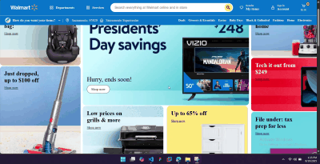

# 🛒 Walmart Front Page Clone



A static **clone of Walmart’s homepage** built using only **HTML**, **CSS**, and **JavaScript**.  
This project focuses on recreating the layout, styling, and interactions of Walmart’s main landing page.

---

## ✨ Features
- 🔍 Walmart-style **search bar** and navigation
- 🖼 **Hero banner** section with promotions
- 🛍 **Product/category** grid layout
- 📱 **Responsive design** for mobile & desktop
- 🎨 Hover effects & simple animations


---

## 🛠 Tech Stack
- **HTML5** – Structure
- **CSS3** – Styling & responsiveness
- **JavaScript** – Basic UI interactions

---

## 🚀 Getting Started

1. **Clone this repo**
   ```bash
   git clone https://github.com/mohamedhasan8403/Walmart-Clone.git

2. **Open index.html in your browser**

##📂 Project Structure

📦 Walmart-Clone
 ┣ 📜 index.html
 ┣ 🎨 style.css
 ┣ ⚙️ script.js
 ┗ 🖼 images/

 

